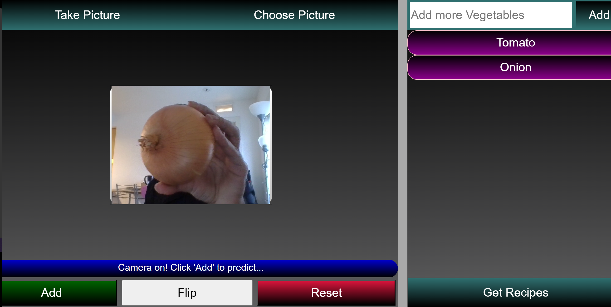
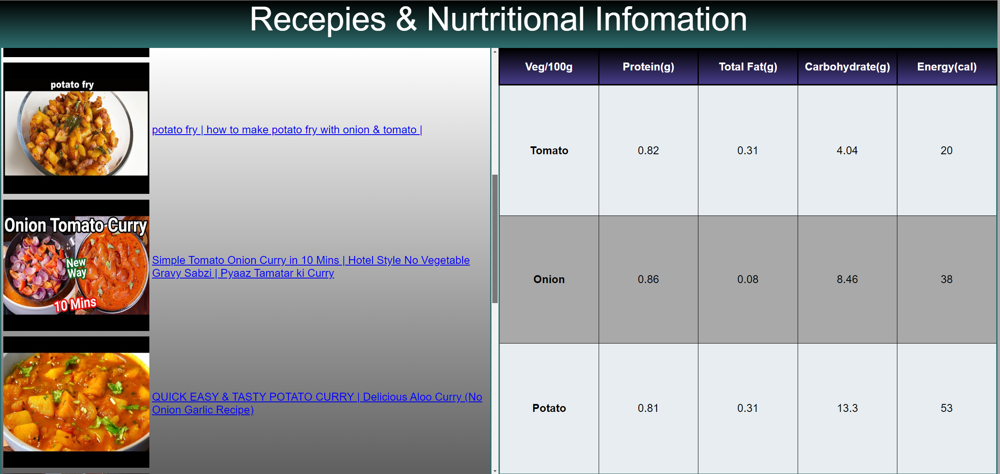

# Vegetable Classification and Recipe Recommendation Project

Welcome to the Vegetable Classification and Recipe Recommendation project! This project seamlessly blends machine learning, web deployment, and web scraping to offer users an engaging experience of identifying vegetables and discovering top-rated recipes.

## Overview

### 1. Vegetable Classification Model:

   - **Objective:** Build an accurate model for classifying 26 different vegetables.
   
   - **Techniques Used:**
     - Transfer learning on MobileNetV2, originally trained on ImageNet.
     - Data augmentation to enhance model robustness.

   - **Training Details:**
     - Custom dataset sourced from Kaggle.
     - Data split into training, validation, and test sets.
     - Achieved a test accuracy of 85.26% through model fine-tuning.

### 2. Web Deployment:

   - **Objective:** Deploy the trained model on a user-friendly webpage using TensorFlow.js.
   
   - **Features:**
     - Real-time vegetable identification using images from webcams or uploads.
     - Seamless integration with JavaScript for an interactive user interface.

### 3. Recipe Recommendations via Web Scraping:

   - **Objective:** Enhance user experience by providing recipe recommendations based on identified vegetables.
   
   - **Implementation:**
     - Web scraping script to fetch top-rated recipes from YouTube Data API.
     - Nutritional facts sourced from the U.S. Department of Agriculture's food data API.

## Web Application

1. **Start by selecting:** Begin the process by choosing to either upload a picture or take one using the camera.

3. **Choose picture:** Select an image from local storage, then click "Add" to initiate the prediction process.

3. **Take picture:** Open the camera, capture an image, and click "Add" to predict the vegetable.

4. **Add vegetable name manually:** Optionally, manually input the vegetable's name.

5. **Hit get recipe button:** Trigger the recipe recommendation by clicking the "Get Recipe" button. Receive a list of recipes along with video links associated with the identified vegetable. Explore nutritional facts about the vegetable from the U.S. Department of Agriculture's official website.

